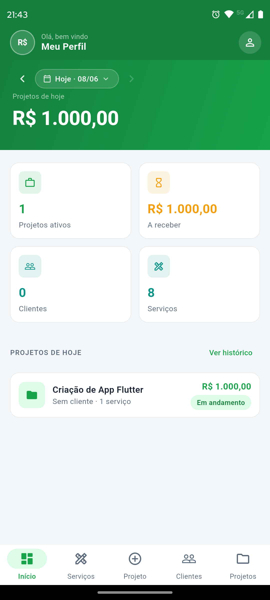
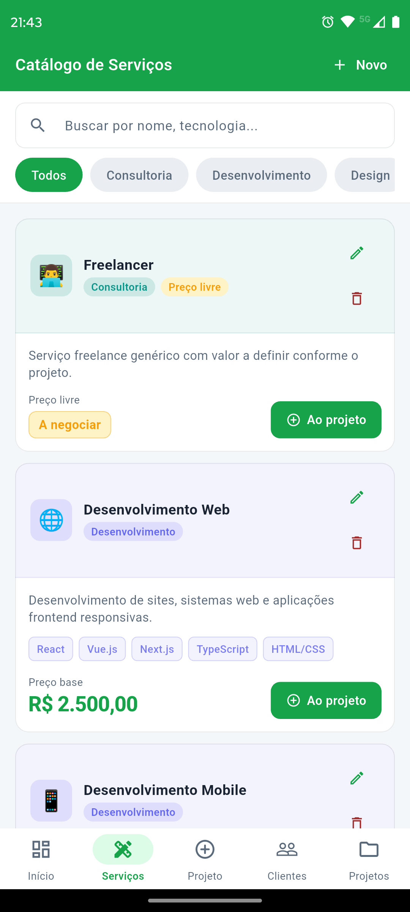
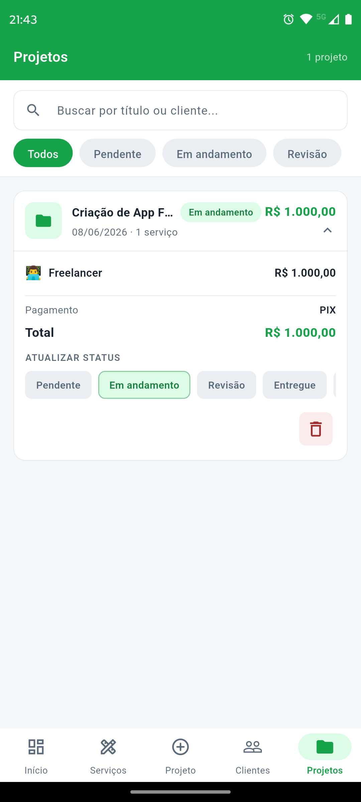

# 💰 Freela Coin

Aplicativo open-source desenvolvido em Flutter para gerenciamento de ganhos, projetos e organização financeira de freelancers.

O Freela Coin foi criado para ajudar profissionais autônomos a acompanharem seus projetos, monitorarem receitas e organizarem pagamentos de forma simples, moderna e intuitiva.

---

# ✨ Funcionalidades

* 📊 Dashboard financeiro
* 💼 Gerenciamento de projetos
* 💰 Controle de ganhos
* 📅 Histórico de pagamentos
* 📈 Acompanhamento financeiro
* 🌙 Interface moderna e responsiva

---

# 📸 Preview do Aplicativo

<div align="center">
  
  
  
</div>

---

# 🚀 Tecnologias Utilizadas

* Flutter
* Dart
* Material Design 3

---

# 📂 Estrutura do Projeto

```bash id="nyh81e"
lib/
├── core/
├── modules/
├── shared/
├── services/
├── widgets/
└── main.dart
```

---

# ⚙️ Como executar o projeto

Clone o repositório:

```bash id="ymlhkc"
git clone https://github.com/andrevloper/freelacoin
```

Entre na pasta do projeto:

```bash id="jlwm7q"
cd freelacoin
```

Instale as dependências:

```bash id="4nqj8j"
flutter pub get
```

Execute o aplicativo:

```bash id="j6m9lj"
flutter run
```

---

# 🤝 Contribuindo

Contribuições são bem-vindas.

1. Faça um fork do projeto
2. Crie sua branch
3. Commit suas alterações
4. Faça push para o GitHub
5. Abra um Pull Request

---

# 🌎 Open Source

Projeto open-source criado para auxiliar freelancers a terem maior controle financeiro e organização dos seus projetos.

---

# 📄 Licença

Este projeto está sob a licença MIT.

---

# 👨‍💻 Autor

André Luiz

⭐ Se gostou do projeto, deixe uma estrela no repositório.
